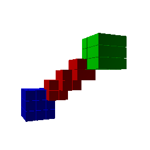
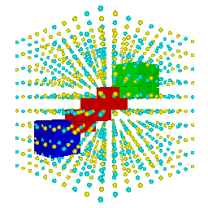
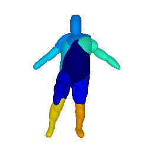

simple-3dviz
---------------

simple-3dviz provides a set of simple and reusable tools for visualizing 3D
data using Python and OpenGL. The goal of this library is to provide an easy
way to visualize 3D objects with hundreds of thousands of vertices efficiently
just with few lines of code.






Key features include:
- Manipulation of meshes from [Wavefront OBJ](https://en.wikipedia.org/wiki/Wavefront_.obj_file), [ASCII OFF](https://people.sc.fsu.edu/~jburkardt/data/off/off.html), [binary/ASCII STL](https://en.wikipedia.org/wiki/STL_(file_format)) and [binary/ASCII PLY](http://paulbourke.net/dataformats/ply/).
- A lightweight and easy-to-use scene viewer using [wxpython](https://wxpython.org/) with support for animation and storing images.
- An offscreen rendering module.
- Helper functions to render pointclouds, lines, voxels and superquadrics.

## Dependencies & Installation

You can install `simple-3dviz` directly from `pip`.
```bash
pip install simple-3dviz
```
If you want to extend our code clone the repository and install it in
development mode. In addition to the main library, there are also two useful
console applications that can be used for visualizing meshes
([mesh_viewer](https://github.com/angeloskath/simple-3dviz/scripts/mesh_viewer.py))
and functions given from the command line
([func_viewer](https://github.com/angeloskath/simple-3dviz/scripts/func_viewer.py)).

The dependencies of `simple-3dviz` are listed below:
- [numpy](http://www.numpy.org/)
- [moderngl](https://github.com/moderngl/moderngl)
- [plyfile](https://github.com/dranjan/python-plyfile)
- [pyrr](https://github.com/adamlwgriffiths/Pyrr)
- [PIL](https://pillow.readthedocs.io/en/stable/index.html) or [OpenCV](https://opencv.org/) (if you want to store the rendering to image files)
- [wxpython](https://wxpython.org/) (if you want to have a GUI)

## Quick Start

You can find various examples of how to use our library in the provided
[scripts](https://github.com/angeloskath/simple-3dviz/simple_3dviz/scripts) and
[examples]([scripts](https://github.com/angeloskath/simple_3dviz/examples).
Below we showcase some basic functionalities implemented in `simple-3dviz`.

```python
from simple_3dviz import Mesh
from simple_3dviz.window import show
from simple_3dviz.utils import render

# We can load meshes from a file by specifying its path or by explicitely
# giving the vertices and the normals of the mesh you want to render
m = Mesh.from_file("models/baby_yoda.stl")

# Preview the mesh in an OpenGL window if you installed wxpython with pip
# Note that you can specify the size (size) and the background color
# (background) of the rendered window as well as the position of the camera in
# the scene (camera_position), its viewing direction (camera_target) and the 3d
# direction that indicates which direction is "up" (up_vector). Finally you can
# also specify the location of the light source as well a set of behaviours to
# be performed.
show(m, camera_position=(-60., -160, 120), camera_target=(0., 0, 40),
     light=(-60, -160, 120))

# Our rendered mesh looks nice already but it is still not very accurate. This
# can be fixed by properly adjuasting the color of the input mesh through the
# color argument
m = Mesh.from_file("models/baby_yoda.stl", color=(0.1,0.5,0.1))

# We can specify various interesting behaviours while rendering our mesh
# Lets start by moving the camera around the object in a circular trajectory
from simple_3dviz.behaviours.movements import CameraTrajectory
from simple_3dviz.behaviours.trajectory import Circle

# The clockwise circular trajectory in 3D is defined by a 3D point that
# indicates the center of the circlular trajectory (center), a 3D point (point)
# and a 3D point that indicates the normal vector (normal). The 3D point point
# indicates the starting point of the trajectory
c = Circle(center=(0, 0, 120.), point=(-60, -160, 120.), normal=(0, 0, 1.))
ctrj = CameraTrajectory(c, speed=0.005)
show(m, camera_position=(-60., -160, 120), camera_target=(0., 0, 40),
     light=(-60, -160, 120), behaviours=[ctrj])

# Nice, but unfortunately the light remains at a fixed position, which means
# that when the camera looks at the back of the object it is not illuminated.
# To fix this we can add another behaviour called LightToCamera.
from simple_3dviz.behaviours.misc import LightToCamera
show(m, camera_position=(-60., -160, 120), camera_target=(0., 0, 40),
     light=(-60, -160, 120), behaviours=[ctrj, LightToCamera()])

# Note that we can also render the scene, without the need for any GUI
# environment using the render(...) function instead of the show(...) function.
# The render function takes the same arguments as the show function with an
# additional argument that indicates the number of frames to be rendered
# (n_frames).
# Saving the rendering results to the hard disk is implemented
# with a behaviour. This allows us to choose how to save the rendered frames
# and reuse the saving code for the show(...) pipeline.
from simple_3dviz.behaviours.io import SaveFrames
# To store the rendered frames to files, we can use the SaveFrames behaviour.
# We simply need to specify the path to save the rendered frames (path).
render(m,
       behaviours=[
            ctrj,
            LightToCamera(),
            SaveFrames("/tmp/frame_{:03d}.png", every_n=5)
       ],
       n_frames=512,
       camera_position=(-60., -160, 120), camera_target=(0., 0, 40),
       light=(-60, -160, 120)
)

# It is also possible to implement some more exciting motions, e.g. having the
# camera move back and forth across a line
from simple_3dviz.behaviours.trajectory import BackAndForth, Lines
render(m,
       behaviours=[
            CameraTrajectory(
                BackAndForth(Lines([-60, -160, 120], [-60, -80, 120])),
                speed=0.005
            )
            LightToCamera(),
            SaveFrames("/tmp/frame_{:03d}.png", every_n=5)
       ],
       n_frames=512,
       camera_position=(-60., -160, 120), camera_target=(0., 0, 40),
       light=(-60, -160, 120)
)

# Let's now try something more exciting! We start, by loading our baby Yoda
# mesh multiple times with different colors
m1 = Mesh.from_file("models/baby_yoda.stl", color=(0.1,0.5,0.1))
m2 = Mesh.from_file("models/baby_yoda.stl", color=(0,1.0,1.0))
m3 = Mesh.from_file("models/baby_yoda.stl", color=(0.5,0.1,0.1))

# We space the meshes across a line in the 3D space, by properly adjusting
# their offset parameter
m2.offset = (-100, 0, 0)
m3.offset = (100, 0, 0)

# We can have the camera moving between the three meshes, following a bezier
# curve, defined using the following control points
from simple_3dviz.behaviours.trajectory import QuadraticBezierCurves, Repeat
traj = Repeat(QuadraticBezierCurves(
    (-1.5*120, 0, 70),
    (-1*120, 80, 70),
    (-0.5*120, 0, 70),
    (0, -80, 70),
    (0.5*120, 0, 70),
    (1*120, 80, 70),
    (1.5*120, 0, 70),
    (1*120, -80, 70),
    (0.5*120, 0, 70),
    (0, 80, 70),
    (-0.5*120, 0, 70),
    (-1*120, -80, 70),
    (-1.5*120, 0, 70)
))

# We now render the three meshes as follows
render([m1, m2, m3],
       behaviours=[
            CameraTrajectory(traj, speed=0.001),
            SaveFrames("/tmp/frame_{:03d}.png", every_n=10)
       ],
       n_frames=999,
       camera_target=(0., 0., 70.0),
       light=(-60, -160, 120)
)

# Using simple-3dviz, we can also visualize point clouds and voxels, lines and
# primitives.
# Let us reproduce the voxel grid example from matplotlib that can be
# found here (https://matplotlib.org/3.2.1/gallery/mplot3d/voxels.html)
import numpy as np
x, y, z = np.indices((8, 8, 8))
cube1 = (x < 3) & (y < 3) & (z < 3)
cube2 = (x >= 5) & (y >= 5) & (z >= 5)
link = abs(x - y) + abs(y - z) + abs(z - x) <= 2
voxels = cube1 | cube2 | link

# Build a voxel grid from the voxels
m = Mesh.from_voxel_grid(
    voxels=voxels,
    sizes=(0.49,0.49,0.49),
    colors=[colormap[c] for c in colors[voxels]]
)

# Set the colors of each object
colors = np.empty(voxels.shape + (3,), dtype=np.float32)
colors[link] = (1, 0, 0)
colors[cube1] = (0, 0, 1)
colors[cube2] = (0, 1, 0)

show(
    Mesh.from_voxel_grid(voxels=voxels, colors=colors),
    light=(-1, -1, 1),
    behaviours=[
        CameraTrajectory(
            Circle(center=(0, 0, 0), point=(2, -1, 0), normal=(0, 0, -1)),
            speed=0.004)
    ]
)

# To visualize a pointloud we can simply use the Spherecloud object
from simple_3dviz import Spherecloud
# We start by generating points uniformly distributed in the unit cube
x = np.linspace(-0.7, 0.7, num=10)
centers = np.array(np.meshgrid(x, x, x)).reshape(3, -1).T
spheres_colors = np.array([[1, 1, 0, 1],
                   [0, 1, 1, 1]])[np.random.randint(0, 2, size=centers.shape[0])]
spheres_sizes = np.ones(centers.shape[0])*0.02

show(
    [
        Mesh.from_voxel_grid(voxels=voxels, colors=colors),
        Spherecloud(
            centers=centers, colors=spheres_colors, sizes=spheres_sizes
        )
    ],
    light=(-1, -1, 1),
    behaviours=[
        CameraTrajectory(
            Circle(center=(0, 0, 0), point=(2, -2, 0), normal=(0, 0, -1)),
            speed=0.004)
    ]
)
```

## Keybord and Mouse Controls for the Scene Viewer

When using the scene viewer via the `show` fuction, it is possible to
perform various actions either using the mouse of the keybord.

- Rotate: Press the left button click
- Pan: Press the middle button click
- Zoom in/out: Scroll the mouse wheel

The available keyboard commands are:
- `R`: Reports the camera position, its vieweing direction and the the 3d
  direction that indicates which direction is "up" at the current timestamp.
- `T`: Make sure that the triangles will be sorted so that the transparency
  works as well.

## Documentation

The module has a dedicated [documentation site](http://simple-3dviz.com) but
you can also read the [source
code](https://github.com/angeloskath/simple-3dviz) and the
[examples](https://github.com/angeloskath/simple-3dviz) to get an idea of how
the library should be used and extended.

## License

Our code is released under the [MIT
license](https://github.com/angeloskath/LICENSE), which practically allows
anyone to do anything with it.
